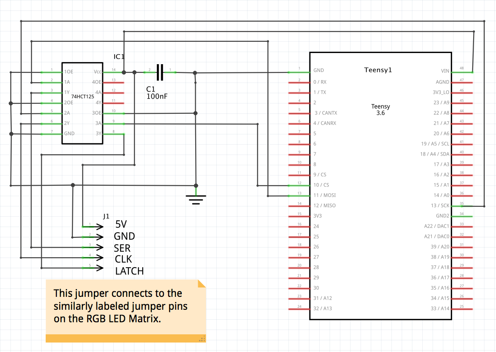

# Ardunio Driver for RGB LED Matrix

To use this driver in the Arduino IDE, add the folder `RGB_LED_Matrix_Lib` as a library as described in [this document](https://www.arduino.cc/en/Guide/Libraries). 

This driver uses SPI to transfer bits to the shift registers. 

## Arduino ATMega Boards

The default wiring for connecting the RGB LED Matrix to an Arduino (Uno, Nano, etc) is:

| LED Matrix Connection | Arduino Pin | Notes |
|:-:|:-:|---|
| +5V | 5V | |
| GND | GND | |
| SER | 11 | SPI MOSI Pin |
| CLK | 13 | SPI SCK Pin |
| LATCH | 10 | SPI SS Pin. Technically, the SS pin is used to control whether an SPI slave is active or not. But, the board isn't strictly implemented and a SPI slave and the logic level sequence is the same as what we'd need for a latch, so using as that. |
| SER' | _unused_ | Used to chain multiple boards together. Would connect to the SER of the next board.|

Note that the SPI MISO pin is unused.

## Teensy 3.x Boards
Using the Teensy 3.x as the driving micro-controller for the RGB LED Matrix is a good choice because it's higher clock speed will allow your code to do more work without interrupting the PWM activities that are also happening at the driver level.

To use this Teensy 3.x driver in the Arduino IDE, add the folder `RGB_LED_Matrix_Lib` as a library as described in [this document](https://www.arduino.cc/en/Guide/Libraries). Also, ensure that the Arduino IDE has been updated to support Teensy development ([see here for more information](https://www.pjrc.com/teensy/td_download.html)).

To use the RGB LED Matrices designed in this project, you must convert the Teensy's 3.3v logic signals to 5V levels. You can easily use a 74HCT125 buffer/line driver chip to do this transformation. For example, you can wire a Teensy 3.6 to a 74HCT125 chip in this manner to get all power and signal lines required to drive the RGB LED Matrix:

